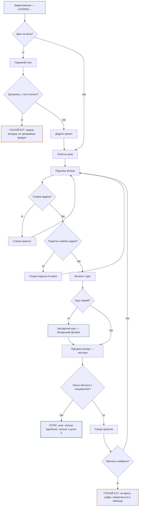
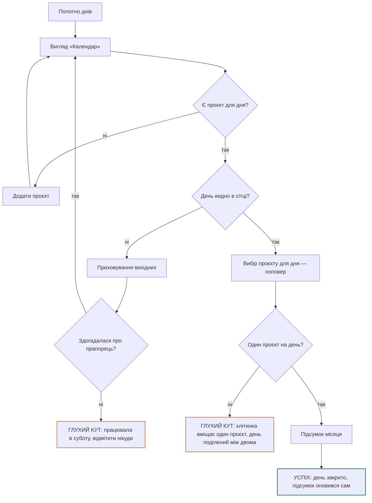
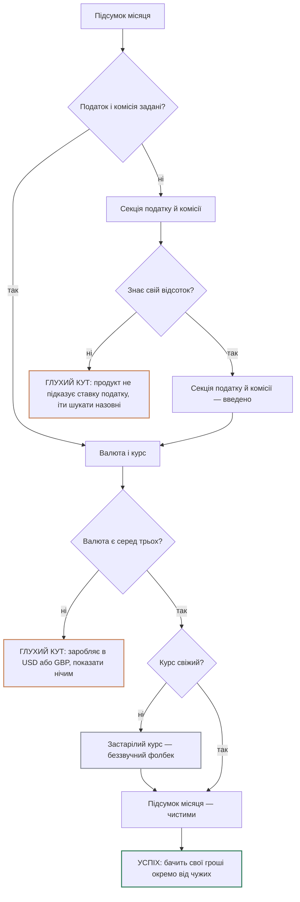
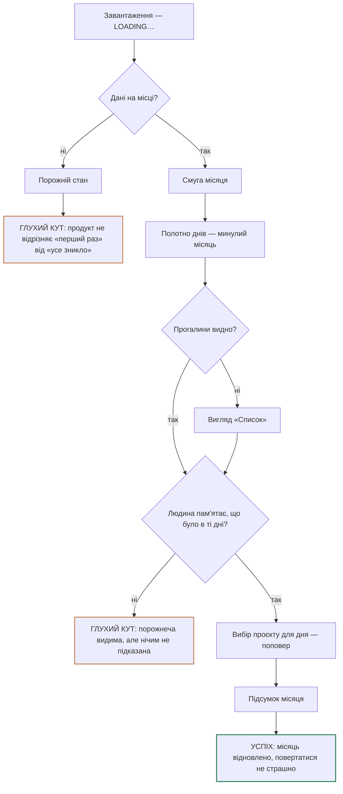

# Structure

Джерела: `research/research.md`, `people/personas.md`.
Персони скорочено: **P1** — та, що веде дні в таблиці (головна); **P2** — той, у кого один
довгий контракт; **P3** — та, у кого фриланс поверх найму; **P4** — той, хто ще не має ставки.

---

## Задачі

Формат: «Коли [ситуація], я хочу [мотивація], щоб [результат]».
Назв функцій у формулюваннях немає — тільки те, чого людина хоче досягти.
Задача, яка ні на що не спирається, лежить нижче в «Гіпотезах», а не тут.

### Головна задача

> **Коли** я працюю на себе і гроші приходять нерівно,
> **я хочу** будь-якої миті розуміти, скільки я насправді заробив і скільки з цього моє,
> **щоб** рішення про роботу й про відпочинок ухвалювати спокійно, а не навмання.

- **Персона:** P1 (головна). Частково P2 — у нього та сама потреба, але з періодичністю раз на місяць.
- **З яких даних:**
  - `research.md` → BENCHMARK → Dimension: вісь «чи тримає продукт живий стан між подіями»,
    виведена з рядка Key mechanic у матриці — кожен конкурент дає відповідь в одній точці часу
  - `research.md` → CONCLUSIONS → рядок «Між подіями стан не існує ні в кого»
  - `research.md` → COMPETITORS → Three shared market patterns, п. 1: усі рахують назад від грошей

**Чесна позначка.** Друга половина цієї задачі — «ухвалювати спокійно, а не навмання» —
спирається на головну біль, яка в `people/personas.md` → Self-critique класифікована як
**hypothesis**: її вивели логічно з чужих продуктів, її ніхто не казав уголос.
Перша половина («скільки з цього моє») стоїть твердо — вона читається з матриці конкурентів.

### Суміжні задачі — 4, на шляху до головної

| # | Задача | Персона | З яких даних |
|---|---|---|---|
| 1 | **Коли** робочий день закінчився, **я хочу** закрити питання обліку за нього одразу, **щоб** воно не накопичувалось у борг, який потім легше кинути, ніж розгребти | P1, P3 | `research.md` → PATTERNS → ключова проблема продукту; PATTERNS → рядок 1, «When it fits»: ввід ретроспективний, треба бачити прогалини; `personas.md` → P1, Pains |
| 2 | **Коли** настав час просити гроші, **я хочу** назвати клієнту суму без сумніву, що вона правильна, **щоб** не перевіряти себе тричі й не боятися помилитись перед ним | P1, P2 | `research.md` → COMPETITORS → матриця, Key mechanic у Harvest («години → рахунок → оплата»); `screens/harvest/07-report-money.webp`; `personas.md` → P2, Jobs |
| 3 | **Коли** я бачу, скільки прийшло, **я хочу** відрізняти чужі гроші від своїх, **щоб** не планувати життя з суми, частина якої мені не належить | P1, P2 | `research.md` → COMPETITORS → матриця, Key mechanic у Hnry (податок утримується до виплати) і Trust у Hnry; Three shared market patterns, п. 1; BENCHMARK → критерій 4 |
| 4 | **Коли** я випав з обліку на кілька тижнів, **я хочу** повернутись без відчуття, що місяць уже втрачений, **щоб** не кидати все й не починати з нуля | P1, P3 | `research.md` → PATTERNS → рядок 2, «When it breaks»: забув запустити — даних немає, забув зупинити — дані брехливі; BENCHMARK → критерій 3 |

**Застереження до задачі 4.** Вона сильніша для P3, а P3 у `people/personas.md` → Self-critique
позначена як **invented** — цієї персони в ресерчі немає взагалі. Але задача не падає разом
із нею: її незалежно тримає рядок 2 у PATTERNS, який описує зрив таймерного вводу на будь-якій
персоні. Тому вона лишається тут, а не в гіпотезах — але з нижчою впевненістю за задачі 1–3.

### Гіпотези

Звучать правдоподібно, не спираються ні на що в ресерчі. Лежать тут, доки не з'являться дані.

| # | Задача | Що її підтвердить | Де шукати |
|---|---|---|---|
| Г1 | **Коли** місяць закінчився, **я хочу** розуміти, чи я йду вгору чи вниз, **щоб** помітити спад раніше, ніж він стане проблемою | Люди самі згадують порівняння з попереднім періодом, розповідаючи про свій облік | П'ять розмов; Strava як позакатегорійний референс — але її не відкривали, у `research.md` вона стоїть із позначкою `[?]` |
| Г2 | **Коли** я вирішую, чи братися за новий проєкт, **я хочу** спиратись на те, як реально йде цей період, **щоб** не погоджуватись зі страху й не відмовлятись навмання | Люди називають рішення «брати чи не брати» серед тих, де їм бракує цифри | П'ять розмов; r/freelance |
| Г3 | **Коли** минув час від першого розрахунку, **я хочу** зрозуміти, чи не продешевив зі ставкою, **щоб** підняти її вчасно, а не через рік | Новачки повертаються до розрахунку вдруге | `research.md` → COMPETITORS → Three open questions, п. 2 фіксує, що калькулятор відкривають один раз — але не каже, чи людина хотіла б повернутись |
| Г4 | **Коли** я надсилаю клієнту рахунок, **я хочу** виглядати як людина, у якої облік у порядку, **щоб** до мене ставились як до підрядника, а не як до знайомого, що підробляє | Люди згадують, як їх сприймає клієнт, коли говорять про облік | Розмови. У ресерчі про це немає жодного рядка |

**Чому Г1–Г3 не в основному списку.** Кожна з них походить з аспіраційних референсів
(Strava, Copilot Money) або з мого припущення в CONCLUSIONS, а не зі спостереження.
`research.md` прямо позначає аспіраційні продукти як `[?]` — їх не відкривали.

---

### Перевірка формулювань

Прогнав кожну задачу через одне питання: **чи можна прибрати з неї будь-яку згадку продукту
і чи лишиться вона правдою про людину?** Нижче — те, що довелося переписати.

| Було в `people/jtbd.md` | Що не так | Стало |
|---|---|---|
| «я хочу **бачити свій поточний стан**» | «стан» — це вже опис екрана, а не бажання людини | «я хочу розуміти, скільки я насправді заробив і скільки з цього моє» |
| «я хочу зафіксувати його **одним рухом**» | «одним рухом» — вимога до рішення, підсунута в задачу | «я хочу закрити питання обліку за нього одразу» |
| «я хочу **отримати готову суму за період**» | «сума за період» — це вихід звіту, тобто функція | «я хочу назвати клієнту суму без сумніву, що вона правильна» |
| «я хочу спокійно **внести їх заднім числом**» | «внести заднім числом» — механіка вводу | «я хочу повернутись без відчуття, що місяць уже втрачений» |
| «я хочу знати, скільки з неї реально моє **після податку й комісії**» | «податок і комісія» — назви полів розрахунку | «я хочу відрізняти чужі гроші від своїх» |

Чисті з першого разу: жодна. Це нормальний результат — у першій версії задачі писались
одразу після ресерчу, де мова ще продуктова.

**Що лишилось свідомо.** У головній задачі є слова «скільки я заробив» — це не функція,
а те, чим людина міряє свою роботу. Прибрати їх означало б втратити предмет задачі.

---

### Матриця — задачі × персони × функції

Оцінка 1–3: наскільки задача важлива для персони. Формат клітинки — `оцінка · чим підтверджено
в research.md`. Де підтвердження немає — `[?]`, без усереднення.
Функції — з `idea.md`. Колонка конкурентів — з `research/research.md`.

| Задача | P1 | P2 | P3 | P4 | Функція prodrec | Закривають конкуренти? |
|---|---|---|---|---|---|---|
| **Головна** — розуміти, скільки заробив і скільки моє | **3** · BENCHMARK → Dimension; CONCLUSIONS → «між подіями стан не існує ні в кого» | 2 · матриця, Key mechanic у Calculator — механізм 226 днів описує його режим, але місяць у нього передбачуваний | `[?]` | 1 · COMPETITORS → Hard, Calculator: приходить із питанням про ставку, а не про облік | Підсумок місяця поруч із календарем: днів, брутто, податок, комісія, чистими (`idea.md` → Основний сценарій, п. 6) | **Ні.** BENCHMARK → Dimension: усі п'ятеро дають цифру в точці події, між подіями — порожньо |
| **1** — закрити облік за день одразу | **3** · PATTERNS → ключова проблема продукту; рядок 1, «When it fits»: ввід ретроспективний | 2 · матриця, Key mechanic у Calculator: йому потрібні саме дні, але вони однакові | `[?]` | 1 · COMPETITORS → Hard, Calculator: обліку не веде | Календар на місяць, призначення проєкту кліком або drag (`idea.md` → Що вже працює) | **Частково.** Harvest має ввід, але через модалку на чотири поля — `screens/harvest/03-new-entry.webp` |
| **2** — назвати клієнту суму без сумніву | **3** · матриця, Key mechanic у Harvest: «години → рахунок → оплата» | 3 · матриця, Key mechanic у Calculator; `personas.md` → P2, Jobs | `[?]` | `[?]` | Брутто по проєктах у підсумку. PDF-інвойс — **ще не збудований** (`idea.md` → Ідеї на потім) | **Так.** Harvest доводить години до рахунку клієнту — матриця, Key mechanic; `screens/harvest/07-report-money.webp` |
| **3** — відрізняти чужі гроші від своїх | **3** · COMPETITORS → Three shared patterns, п. 1; матриця, Key mechanic у Hnry | 3 · матриця, Audience у Hnry — sole trader на контракті це і є P2 | `[?]` | 3 · матриця, Key mechanic у Calculator: увесь механізм іде від бажаного **чистого** доходу | Відсоток податку + комісія за місяць → чистий прибуток (`idea.md` → Що вже працює) | **Частково.** Hnry вміє, але лише в одній юрисдикції — матриця, Audience. Harvest не рахує чистий узагалі |
| **4** — повернутись після пропуску | 2 · PATTERNS → рядок 1, «When it fits»: треба бачити прогалини; BENCHMARK → критерій 3 | 1 · `personas.md` → P2, Context: день завжди повний, прогалини рідкісні | `[?]` | `[?]` | Календар дозволяє відмітити будь-який минулий день (`idea.md` → Основний сценарій, п. 3) | **Частково.** Календарні продукти вміють, таймерні ні — PATTERNS → рядок 2, «When it breaks» |

**Чому вся колонка P3 порожня.** Персона 3 у `people/personas.md` → Self-critique позначена як
**invented** — її в ресерчі немає, а її Jobs позначені `[?]`. Виводити з неї оцінки означало б
надати вагу вигаданому. Практичний наслідок: **P3 зараз не впливає на пріоритети взагалі** —
або її підтверджують розмовами, або вона йде з проєкту.

Гіпотези з попереднього розділу в матрицю не входять — оцінювати нічим:

| Гіпотеза | P1–P4 | Функція prodrec | Закривають конкуренти? |
|---|---|---|---|
| Г1 — розуміти, чи йду вгору | `[?]` | Річний огляд і статистика по проєктах — **не збудовано** (`idea.md` → Ідеї на потім) | **Ні** в категорії. Поза категорією — Strava, але її не відкривали |
| Г2 — спиратись на період у рішенні про новий проєкт | `[?]` | Немає | `[?]` |
| Г3 — зрозуміти, чи не продешевив | `[?]` | Немає: ставка зберігається в проєкті, історії ставок немає | **Ні.** У калькулятора немає пам'яті — COMPETITORS → Three open questions, п. 2 |
| Г4 — виглядати як людина з порядком в обліку | `[?]` | PDF-інвойс — **не збудовано** | `[?]` |

---

### Ядро продукту — три задачі

Читається прямо з матриці: оцінка **3 у головної персони** і колонка конкурентів **не «Так»**.

1. **Головна — розуміти, скільки заробив і скільки моє.**
   P1 = 3, конкуренти = **Ні**. Єдина задача в таблиці, яку не закриває взагалі ніхто.
2. **Суміжна 1 — закрити облік за день одразу.**
   P1 = 3, конкуренти = **Частково**. Найближчий, Harvest, вимагає чотирьох полів на день.
3. **Суміжна 3 — відрізняти чужі гроші від своїх.**
   P1 = 3, конкуренти = **Частково**. Hnry вміє, але ціною однієї юрисдикції.

**Що не потрапило і чому.** Суміжна 2 має P1 = 3, але колонка конкурентів каже **Так** —
Harvest це вже вміє, і змагатись тут означало б витрачати сили на паритет.
Суміжна 4 має P1 = 2 — вона важлива, але не настільки, щоб визначати ядро.

### Функції-сироти

Функції з `idea.md`, які не закривають жодної задачі з таблиці вище.
**Сирота не означає «непотрібна»** — вона означає одне з двох: або функція зайва,
або в списку задач бракує задачі, яку вона закриває. Що саме — рішення не ухвалене.

| Функція | Стан | Чому сирота |
|---|---|---|
| **Три валюти з живим курсом** (EUR, PLN, UAH) | збудовано | Жодна задача не згадує валюту. У `research.md` її теж немає: Calculator має 7 юрисдикцій, але про конвертацію в матриці нічого. Прийшла з `idea.md` → Проблема, а не з ресерчу. **Найімовірніше, бракує задачі** — про життя й заробіток у різних валютах |
| **Приховування вихідних** | збудовано | Не закриває нічого. Зручність показу, не потреба людини |
| **List як другий вигляд** | збудовано | Календар закриває задачу 1; окремий список не додає нової задачі. Можливо, обслуговує перегляд перед рахунком — але тоді це частина задачі 2, і це треба перевірити |
| **Акаунти й синхронізація** (Supabase) | план | Жодна задача не говорить про кілька пристроїв. Бракує задачі або функція передчасна |
| **Річний огляд і статистика** | план | Закриває тільки Г1, а Г1 — гіпотеза без даних |
| **Pro-тариф через Stripe** | план | Не закриває задач за визначенням — це бізнес-модель. У `research.md` → Three open questions, п. 3 вона досі відкрита |
| **Години для окремого дня** | план | Уточнює точність задачі 1, але окремої задачі не закриває. `idea.md` → Модель обліку сам називає це «наступним кроком», не потребою |

**Одна функція навмисно не тут.** «Без реєстрації, дані в браузері» не закриває жодної задачі —
і це нормально: у `people/personas.md` → P1, Trust triggers вона стоїть як **тригер довіри**,
а не як робота. Тригери довіри не мусять закривати задачі.

---

## Екрани

### Головні об'єкти продукту

Зчитані зі стану застосунку в `timetracker.jsx`, а не придумані. Екрани нижче виведені з них.

| Об'єкт | Що це | Де живе в коді |
|---|---|---|
| **День** | Атом обліку: дата + проєкт. Усе інше — похідне | `days` |
| **Місяць** | Контейнер днів і одиниця, у якій рахується підсумок | `currentMonth` |
| **Проєкт** | Назва, колір, ставка. Належить людині, не місяцю | `projects` |
| **Податок і комісія** | Належать **місяцю**, а не проєкту, з наслідуванням від попереднього | `taxByMonth`, `commissionByMonth` |
| **Валюта і курс** | Глобальні, живий курс із кешем | `currency`, `rates`, `ratesUpdatedAt` |
| **Підсумок** | Похідний, ніде не зберігається — рахується щоразу | `projectStats` |
| **Вихідні** | Прапорець показу, належить місяцю | `weekendsByMonth` |

Дві речі, які видно вже тут: **податок належить місяцю, а ставка — проєкту** (це і є причина,
чому чистий прибуток не можна порахувати на рівні одного дня), і **підсумок ніде не
зберігається** — тобто «живий стан» технічно вже реалізований, він перераховується сам.

### Карта екранів

```
Легенда:  ★ — потрібен головній персоні (P1)
          (…) — задача, яку екран закриває
          СИРОТА — не закриває жодної задачі з таблиці вище
          ○ — не збудовано

prodrec
│
├─ ★ Завантаження — «LOADING…»
│      (Головна — стан входу: доки воно на екрані, продукту не існує)
│
└─ ★ Місяць — єдиний екран продукту сьогодні
   │    (Головна: розуміти, скільки заробив і скільки моє)
   │
   ├─ ★ Смуга місяця — крок назад і вперед
   │      (Суміжна 4: повернутись після пропуску)
   │
   ├─ ★ Полотно днів
   │  │    (Суміжна 1: закрити облік за день одразу)
   │  │
   │  ├─ ★ Вигляд «Календар» — клік або протягування
   │  │      (Суміжна 1)
   │  │
   │  ├─ ★ Вибір проєкту для дня — поповер на клітинці
   │  │      (Суміжна 1)
   │  │
   │  ├─ ○ ★ Порожній стан — місяць, у якому ще нічого немає
   │  │      (Суміжна 1 — саме тут вирішується, чи буде перший запис узагалі)
   │  │
   │  ├─ Вигляд «Список»
   │  │      СИРОТА — календар уже закриває Суміжну 1
   │  │
   │  └─ Приховування вихідних
   │         СИРОТА
   │
   ├─ ★ Секція проєктів
   │  │    (Суміжна 2: назвати клієнту суму без сумніву)
   │  │
   │  ├─ ★ Рядок проєкту — назва, колір, відпрацьовано днів, брутто
   │  │      (Суміжна 2)
   │  │
   │  ├─ ★ Ставка проєкту
   │  │      (Суміжна 3 — без ставки чистого не існує)
   │  │
   │  ├─ ★ Додати проєкт
   │  │      (Суміжна 1 — доки немає проєкту, день нікуди відмітити)
   │  │
   │  └─ Видалити проєкт — з підтвердженням
   │         (Суміжна 1 — службова дія всередині неї)
   │
   ├─ ★ Секція податку й комісії
   │      (Суміжна 3: відрізняти чужі гроші від своїх)
   │
   ├─ Валюта і курс
   │  │    СИРОТА — жодна задача не згадує валюту.
   │  │    Найімовірніше означає пропущену задачу, а не зайву функцію
   │  │
   │  └─ ○ ★ Застарілий курс — беззвучний фолбек
   │         (Суміжна 3) — курс із кешу підставляється мовчки.
   │         Дата поруч є, попередження немає: людина не знає,
   │         що бачить учорашнє число
   │
   └─ ★ Підсумок місяця — днів, брутто, податок, комісія, чистими
          (Головна) — ядро продукту, решта екрана існує заради цих п'яти чисел

○ Рік
│    (Г1 — гіпотеза, не задача. Будувати рано)
└─ ○ Порівняння з минулим періодом
       (Г1 — гіпотеза)

○ Рахунок — експорт для клієнта
     (Суміжна 2) — але ринок її вже закриває: Harvest, research.md → матриця

○ Профіль і синхронізація
     СИРОТА — жодна задача не говорить про кілька пристроїв

○ Налаштування
     СИРОТА як окремий екран — валюта, податок і комісія вже живуть
     на місці використання, і це правильно
```

### Що з цієї карти видно

**Один екран закриває все ядро.** Головна задача, Суміжна 1 і Суміжна 3 — три задачі ядра —
закриваються не трьома екранами, а трьома секціями одного. Це прямий наслідок того, що
підсумок похідний: він може стояти поруч із полотном і оновлюватись сам.

**Три сироти вже збудовані** — «Список», приховування вихідних і валюта. Це не борг, який
треба терміново гасити, але це те, що займає місце на єдиному екрані продукту.

**Найважливішого екрана ще немає.** Порожній стан — єдиний доданий у карту як `○ ★`.
`research.md` → COMPETITORS ставив задачу вивчити порожні стани Toggl, а
`screens/harvest/05-week-empty.webp` показує, як це робить Harvest: порожнеча пояснює, для чого
екран. У prodrec перший запуск зараз нічим не відрізняється від тридцятого.

### Головне меню

**Сьогодні prodrec не потребує головного меню.** Один екран закриває три задачі ядра;
меню з одним пунктом — це шум. Перемикач «Календар / Список» меню не є, і він до того ж
веде до сироти.

Меню з'являється тоді, коли з'явиться друга сторінка. Ось у якому порядку і за що:

| # | Пункт | Задача за ним | Коли з'являється |
|---|---|---|---|
| 1 | **Місяць** | Головна — розуміти, скільки заробив і скільки моє | Уже є. Стає пунктом меню лише коли поруч стане другий |
| 2 | **Проєкти** | Суміжна 2 — назвати клієнту суму без сумніву. Плюс Суміжна 3: тут живуть ставки | Коли проєктів стане більше, ніж уміщає бічна секція. Для P1 з 1–3 клієнтами — не скоро |
| 3 | **Рахунок** | Суміжна 2 | Коли з'явиться експорт. Але це паритет із Harvest, а не перевага |
| 4 | **Рік** | Г1 — **гіпотеза**, не задача | Тільки після того, як розмови підтвердять, що порівняння з минулим комусь потрібне |

**Чого в меню немає навмисно.** «Налаштування» — бо валюта, податок і комісія стоять там, де
використовуються, і виносити їх у окремий екран означало б розірвати Суміжну 3.
«Профіль» — бо жодна задача не говорить про акаунт, а `personas.md` → P1, Trust triggers
називає роботу без реєстрації тригером довіри. Додати профіль — це зняти довіру заради
функції, якої ніхто не просив.

### Сценарії

Кроки — тільки екрани з карти вище. Розвилки — питання з двома гілками.
Обидва фінали показані: успішний і той, де людина застрягає.

**Два екрани довелося додати в карту, поки малював сценарії** — обидва підтверджені в коді,
не вигадані: «Завантаження» (`timetracker.jsx`, рядок 464) і «Застарілий курс», який
спрацьовує мовчки (рядки 636–637: дата є, попередження немає).

---

#### Головна — розуміти, скільки заробив і скільки моє



Людина відкриває продукт і першим бачить не його, а «LOADING…». Якщо дані з минулого разу на
місці — одразу потрапляє на полотно днів і бачить підсумок. Якщо ні — потрапляє в порожній стан,
і тут перша розвилка: або зрозуміла, з чого почати, або закрила вкладку назавжди.

Далі підсумок сам себе добудовує: немає ставки — веде в проєкт, немає податку — веде в секцію
податку. Курс може не завантажитись, і тоді підставиться вчорашній — **мовчки**, це найтихіше
місце сценарію. Фінальна розвилка найважливіша: якщо число не збігається з очікуванням і людина
не знайшла причини, вона не просто йде — вона перестає вірити продукту й повертається в таблицю.

---

#### Суміжна 1 — закрити облік за день одразу



Найкоротший сценарій продукту — і саме тому найважливіший. У щасливому випадку це два кліки:
клітинка, проєкт, підсумок перерахувався сам.

Обидва глухі кути тут не вигадані. Перший: **приховування вихідних** ховає клітинки суботи
й неділі — якщо людина працювала у вихідний, вона фізично не має куди клікнути, і продукт
ніяк не підказує чому. Другий: поділений день між двома проєктами — це рівно та межа
календаря-полотна, яку `research.md` → PATTERNS назвав умовою поломки.

---

#### Суміжна 3 — відрізняти чужі гроші від своїх



Задача ядра, і водночас та, де продукт найбільше залежить від знань людини. Ми питаємо відсоток
податку — але нічим не допомагаємо його дізнатися. Це прямий наслідок відкритого питання №1
з `research.md`: у режимі «Світ» податок вводить користувач сам, і обіцянка слабша за
«ми порахуємо за тебе».

Другий глухий кут — три валюти. Для фрилансера, що працює з США чи Британією, продукт просто
не має чим показати результат.

---

#### Суміжна 4 — повернутись після пропуску



Тут головна сила продукту й головна його вразливість стоять поруч. Сила: календар **показує
прогалину** — незафарбований вівторок сам нагадує про себе, чого таймерні продукти не вміють
у принципі.

Вразливість подвійна. Перше: дані живуть у localStorage, тому інший браузер або очищена історія
дають порожній екран — і продукт **не може відрізнити** новачка від людини, яка щойно втратила
рік роботи. Друге: календар показує, що день порожній, але не підказує, що там **було**.
Пам'ять доводиться відновлювати самотужки — з пошти, календаря, чатів.

**Про Суміжну 2.** Її сценарій свідомо не намальований: він упирається в екран «Рахунок»,
якого не існує (`○` у карті). Малювати схему з незбудованим фіналом — це видавати намір
за продукт.

---

> **Примітка про джерела.** Цей розділ і `people/jtbd.md` описують те саме різними словами.
> Два джерела правди — це те, чого ми уникаємо. Треба звести: або `people/jtbd.md` лишається
> канонічним (шлях, який очікує design-spec-framework), або цей розділ, а `jtbd.md` іде
> в історію. Рішення не ухвалене.
